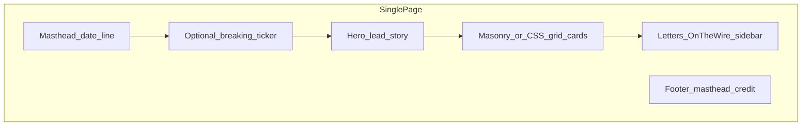

# The AI Dispatch — product & content specification (March 24, 2026)

Use this document as the single source of truth before writing code. **All news items below were cross-checked via web retrieval against primary pages dated March 23–24, 2026** (Nvidia/Verge is March 23 podcast coverage; everything else is explicitly March 24 unless noted). **Reddit pull-quotes** in the shipped UI are **verbatim** text from real comments; **canonical permalinks** are stored in [`app/page.tsx`](app/page.tsx) (`WIRE_QUOTES`). Candidate threads listed in §5 are not always indexed by third-party archives; quotes were verified against the Pullpush Reddit comment index where direct Reddit JSON was unavailable.

---

## 1. Goals and constraints

| Requirement | Detail |
| ----------- | -------------------------------------------------------------------------------------------------------------------------------------------- |
| Scope       | One URL, no client-side routing, no backend, **no runtime API calls**; all copy and links **hardcoded**                                      |
| Topic       | **AI news only** for **March 24, 2026** (with one clearly labeled “overnight” item if using Mar 23 primary coverage)                         |
| Feel        | Broadsheet front page: big masthead, multi-column grid, ink-on-paper, **modern** web polish                                                  |
| Typography  | **Serif** for headlines/display; **sans** for body, meta, labels                                                                             |
| Palette     | Mostly **black, white, sepia/cream**, **one accent** (e.g. deep red or teal—pick one and use consistently)                                   |
| Motion      | Microinteractions on hover for cards; optional **printing-press** headline treatment; optional **breaking news ticker**                      |
| Sidebar     | Styled as **“Letters to the Editor”** or **“On the Wire”** — **man-on-the-street** tone from **Reddit** (or similar), not technical analysis |

**Repo reality:** [`package.json`](package.json) is **Next.js 14 + React 18 + Tailwind 3**. That satisfies “minimal React” for a single page ([`app/page.tsx`](app/page.tsx)). Alternatively ship **`public/newspaper.html`** as a fully self-contained artifact—choose one in implementation.

---

## 2. Information architecture

- **Masthead:** e.g. `THE AI DISPATCH` + decorative rule + `Tuesday, March 24, 2026` + optional tagline (“All signal. One page.”).
- **Ticker (optional):** Short rotating strings summarizing 3–4 stories (hardcoded array; CSS marquee or horizontal scroll with `prefers-reduced-motion` fallback).
- **Hero:** Largest story of the day (Anthropic / Claude computer use — see §4).
- **Grid:** **8 cards** (within your 6–10 range), mixed **span widths** (e.g. CSS Grid `grid-column: span 2` on 2–3 cards).
- **Sidebar:** Pull-quotes + attribution (`u/username` · `r/subreddit`) + link “View thread” to real Reddit URLs.

---

## 3. Design system (tokens)

Implement in CSS variables (Tailwind `@layer` or plain CSS in [`app/globals.css`](app/globals.css)):

- **Paper:** `--paper: #f4f1e8` (adjust), subtle noise texture optional (`background-image` PNG or CSS noise).
- **Ink:** `--ink: #0a0a0a`, muted `--ink-muted: #3d3d3d`.
- **Rules:** 1px hairlines `#1a1a1a` / `#c9c2b4`.
- **Accent:** single hue for “Extra”, links on hover, ticker bullet.
- **Fonts:** Load **two families** via `next/font` or Google Fonts link: e.g. **Fraunces** or **Newsreader** (headlines), **Source Sans 3** or **IBM Plex Sans** (body). Avoid default `system-ui` for the final look.
- **Dark mode:** Current [`globals.css`](app/globals.css) may use `prefers-color-scheme: dark`. For this page, **force light “newsprint”** (override or scope styles under a wrapper `.ai-dispatch` so the newspaper aesthetic wins).

---

## 4. Content manifest — verified stories (hardcode these)

Each card: `headline`, `dek` (one sentence), `source` (outlet name), `url` (canonical HTTPS), optional `note` for dateline nuance.

### Hero (lead)

- **Headline:** Anthropic says Claude can use your computer to finish tasks  
- **Lede:** Users can message Claude from a phone and have the agent open apps, use a browser, and work across spreadsheets on the desktop, with Anthropic highlighting safeguards and permission prompts for new apps.  
- **Source:** CNBC  
- **URL:** https://www.cnbc.com/2026/03/24/anthropic-claude-ai-agent-use-computer-finish-tasks.html

### Card 2 — same beat, tech press angle

- **Headline:** Anthropic’s Claude Code and Cowork can control your computer  
- **Dek:** Coverage of Anthropic’s computer-use push alongside the broader race among AI agents.  
- **Source:** The Verge  
- **URL:** https://www.theverge.com/ai-artificial-intelligence/899430/anthropic-claude-code-cowork-ai-control-computer

### Card 3 — hardware / China

- **Headline:** Alibaba unveils next-gen XuanTie chip for agentic AI  
- **Dek:** Alibaba details a 5nm XuanTie C950 server CPU on RISC-V, billed as a step up for agentic AI and cloud workloads.  
- **Source:** Reuters  
- **URL:** https://www.reuters.com/world/asia-pacific/alibaba-develops-next-gen-chip-agentic-ai-chinese-media-says-2026-03-24/

### Card 4 — enterprise software

- **Headline:** Oracle reworks finance and procurement apps for AI agents  
- **Dek:** Oracle is updating Fusion so humans ask business questions while agents gather data and recommendations across scattered systems.  
- **Source:** Reuters  
- **URL:** https://www.reuters.com/business/oracle-reworks-its-finance-procurement-apps-ai-agents-2026-03-24/

### Card 5 — OpenAI philanthropy (March 24)

- **Headline:** OpenAI Foundation lays out $1B+ in first-year spending plans  
- **Dek:** Bret Taylor outlines initial programs across life sciences, jobs, AI resilience, and communities, including Alzheimer’s research and biosecurity.  
- **Source:** OpenAI  
- **URL:** https://openai.com/index/update-on-the-openai-foundation/

### Card 6 — ChatGPT product (March 24)

- **Headline:** Richer product discovery lands in ChatGPT  
- **Dek:** OpenAI expands the Agentic Commerce Protocol for more visual shopping, comparisons, and merchant integrations including Walmart’s in-chat experience.  
- **Source:** OpenAI  
- **URL:** https://openai.com/index/powering-product-discovery-in-chatgpt/

### Card 7 — ChatGPT feature (March 24)

- **Headline:** ChatGPT adds a Library for uploaded files  
- **Dek:** Paid tiers get a persistent file library that survives chat deletion, with regional rollout limits noted by third-party coverage referencing OpenAI’s help docs.  
- **Source:** gHacks (summarizing OpenAI documentation)  
- **URL:** https://www.ghacks.net/2026/03/24/openai-introduces-chatgpt-library-to-store-uploaded-files-in-one-place/  
- **Also cite (optional footnote):** https://help.openai.com/en/articles/20001052-library-for-chatgpt

### Card 8 — “Overnight” / definition-of-AGI debate (March 23 coverage)

- **Headline:** Nvidia CEO says “I think we’ve achieved AGI” — then qualifies it  
- **Dek:** On the Lex Fridman podcast, Jensen Huang ties “AGI” to job-like outcomes and agent platforms, then pushes back on whether many small agents could build a company like Nvidia.  
- **Source:** The Verge  
- **URL:** https://www.theverge.com/ai-artificial-intelligence/899086/jensen-huang-nvidia-agi  
- **Note:** Article timestamp **Mar 23, 2026**; label card dateline **“Mar 23 (overnight)”** or similar so the page stays honest.

**Ticker suggestions (hardcoded strings):** rotate shortened versions of Anthropic computer use, Alibaba XuanTie, Oracle Fusion agents, OpenAI Foundation update, ChatGPT shopping/ACP.

---

## 5. “On the Wire” / Reddit — verification workflow (required)

**Do not invent usernames or quotes.** During implementation:

1. Open candidate threads (examples to search; **confirm relevance and date in UI**):
   - `https://www.reddit.com/r/claude/comments/1rto6b0/things_anthropic_launched_in_last_70_days_of_2026/`  
   - `https://www.reddit.com/r/OpenAI/comments/1ryvw16/openai_is_throwing_everything_into_building_a/` (title from search; verify)
2. Pick **4–6** short quotes (1–2 lines) that sound like **reactions** (surprise, jokes, worry), not essays.
3. Store: `quote`, `user`, `subreddit`, `threadUrl`.
4. If Reddit blocks programmatic access, **manual copy from the browser** is acceptable; still **real** text only.

---

## 6. Interaction spec

| Element    | Behavior                                                                                                   |
| ---------- | ---------------------------------------------------------------------------------------------------------- |
| News cards | Hover: slight lift (`translateY`), shadow or ink bleed, rule color shift; respect `prefers-reduced-motion` |
| Headlines  | Optional: staggered reveal on load (`@keyframes`) or “ink spread” opacity mask—subtle, not flashy          |
| Ticker     | Pauses on hover; hides or static list if reduced motion                                                    |
| Links      | “Read more” is `<a href="..." target="_blank" rel="noopener noreferrer">`                                  |
| Focus      | Visible `:focus-visible` rings for keyboard users                                                          |

---

## 7. Layout notes (CSS Grid)

- Wrapper `max-width: 1200–1400px`, outer padding, **column-count feel** on desktop.  
- Grid e.g. `grid-template-columns: repeat(12, 1fr); gap: 1rem;` — cards `span 4`, `span 6`, `span 8` for variety.  
- Sidebar: on **wide** screens, right column ~30%; stack below hero on **narrow** screens.

---

## 8. Build / file checklist (implementation)

- **If Next:** Replace [`app/page.tsx`](app/page.tsx) with composed sections; add fonts in [`app/layout.tsx`](app/layout.tsx); extend Tailwind theme in [`tailwind.config.js`](tailwind.config.js) with serif/sans families and paper colors.  
- **If standalone HTML:** Single file with embedded `<style>` + minimal JS for ticker only; no build step.  
- **Quality bar:** Lighthouse-friendly static assets; no external runtime dependencies for content.

---

## 9. Pre-code research gate (already satisfied for news)

Planning research validated primary URLs for **Anthropic (CNBC)**, **Alibaba & Oracle (Reuters)**, **OpenAI Foundation & Product Discovery (openai.com)**, **ChatGPT Library (gHacks + help link)**, **Nvidia AGI (The Verge)**. Reddit quotes are documented in code with permalinks per §5.
